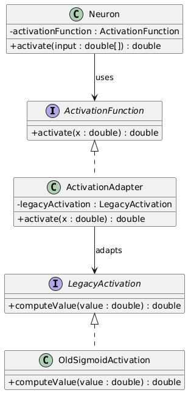
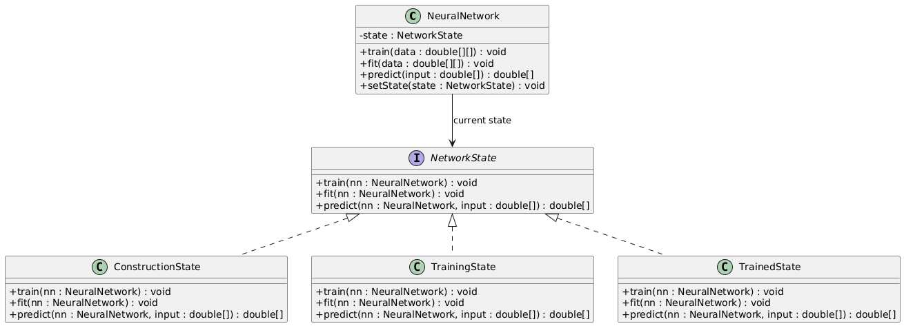
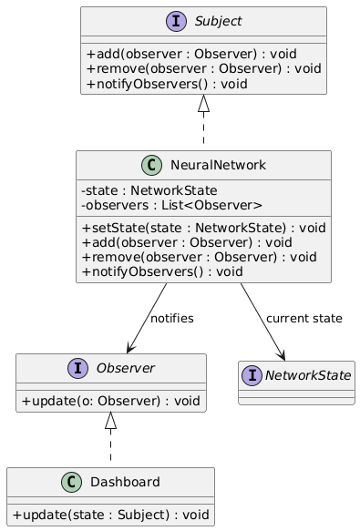

# Neural Net

## Architecture générale

Le réseau de neurones est composé de :

* couches (`Layer`)
* neurones (`Neuron`)
* connexions pondérées
* fonctions d’activation interchangeables

Il expose des opérations principales telles que :

* `train(...)`
* `fit(...)`
* `predict(...)`

---

## Design Patterns utilisés

### Strategy — Fonctions d’activation

Les fonctions d’activation sont encapsulées et interchangeables grâce au patron **Strategy**.

Exemples :

* Sigmoid
* ReLU
* Tanh

Chaque neurone délègue le calcul de l’activation à une instance de `ActivationFunction`.

📷 Diagramme UML :

---

### Adapter — Fonctions d’activation héritées

Certaines fonctions d’activation anciennes implémentent une interface incompatible avec celle utilisée par les neurones.
Le patron **Adapter** permet d’intégrer ces composants sans modifier leur code.

📷 Diagramme UML :

---

### State — États du réseau de neurones

Le réseau peut se trouver dans trois états :

* **Construction** (état initial)
* **Training**
* **Trained**

Le comportement du réseau dépend de son état :

* `predict()` n’est autorisée que dans l’état *Trained*
* `train()` déclenche la transition vers l’état *Training*

📷 Diagramme UML :

---

### Observer — Notification des changements d’état

Les composants dépendants (ex. : tableau de bord, monitoring) doivent être notifiés lorsque l’état du réseau change.
Le patron **Observer** permet une notification automatique sans couplage fort.

📷 Diagramme UML :

## 🧪 Qualités de l’architecture

* ✅ Respect des principes **SOLID**
* ✅ Faible couplage
* ✅ Forte cohésion
* ✅ Architecture extensible
* ✅ Facilité d’évolution (nouveaux états, fonctions, observateurs)

